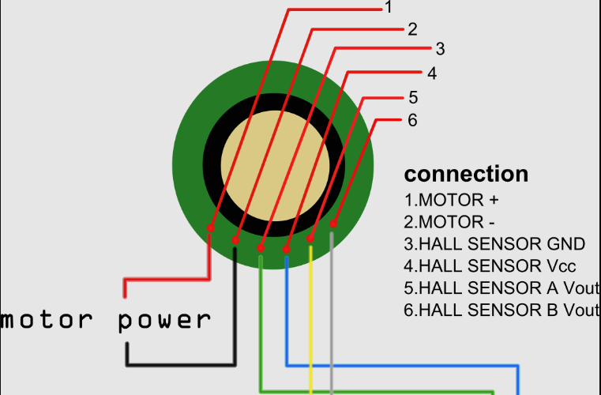
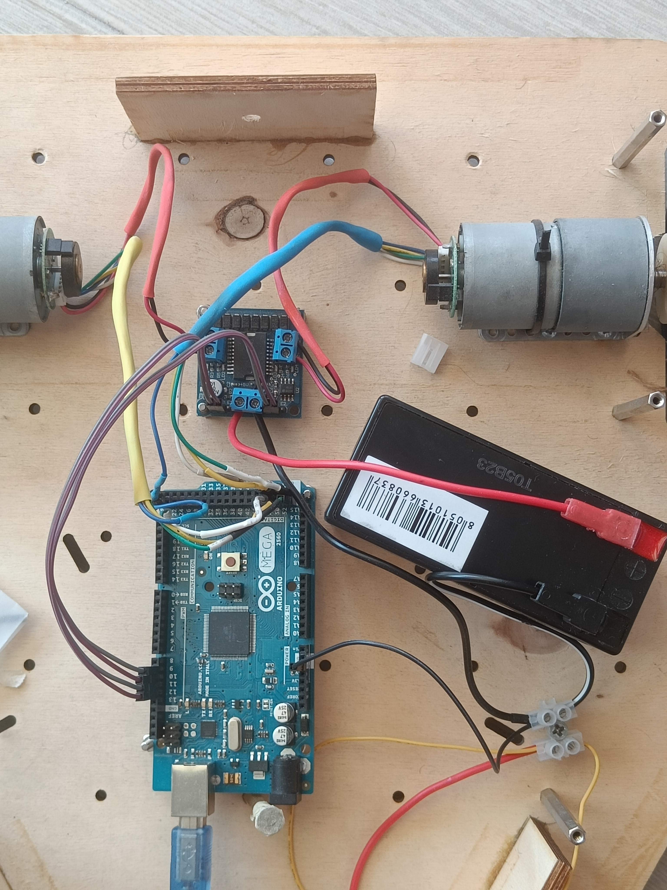
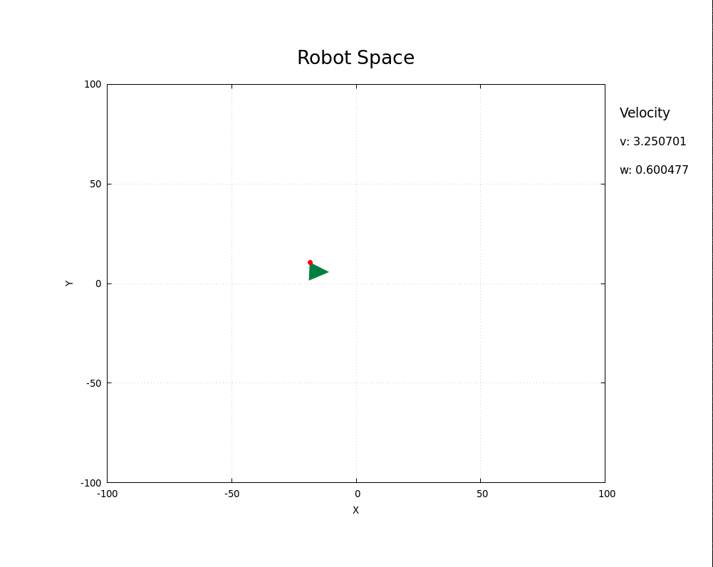

# Joystick Controlled Arduino Robot

This project implements a joystick controlled robot using an Arduino Mega 2560. The robot has two DC motors with encoders, and a joystick to control its speed and direction. The speed of the motors is controlled by a PID controller. The client sends the joystick values to the microcontroller, which in turn sends the odometry calculations. The client plots these values in real-time using gnuplot.

## Hardware Configuration

For this project I used the following hardware components:
- Arduino Mega 2560
- DC Motor with encoder
- H bridge [MR001-004.1](https://www.gotronic.fr/pj-983.pdf)
- Power supply 12V
- Joystick

### Cabling

Each motor should have an encoder attached to it with the following connections:



The motor power supply should be connected to the H bridge, while other cables should be connected to the Arduino as follows:
- GND and VCC to their respective pins GND and 5V
- Left Encoder A: pin 53 
- Left Encoder B: pin 51 
- Right Encoder A: pin 52 
- Right Encoder B: pin 50 

The h-bridge power supply should be connected to the 12V battery, sharing the GND with the Arduino. Its control pins should be connected to the Arduino as follows:
- Left Motor A: pin 9
- Left Motor B: pin 10
- Right Motor A: pin 11
- Right Motor B: pin 12



## Usage

```bash
git clone https://github.com/kristoji/arduino-motor_speed_PID_controller
cd arduino-motor_speed_PID_controller/src/server
make run
cd ../client
make run
```

By default:
- the Arduino port is `/dev/ttyACM0`. You can change it by modifying the `AVRDUDE_PORT` variable in the `src/server/avr.mk` file.
- the joystick port is `/dev/input/js0`. You can change it by modifying the `DEV_JS` macro in the `src/client/jstick.h` file.
- The update delay of the arduino is 50ms. You can change it by modifying the `UPDATE_MS` macro in the `src/server/time.h` file.
- The delay in sending the control from the client is 1s. You can change it by modifying the `DELAY_SEND_CONTROL` macro in the `src/client/client.h` file.


## Results

